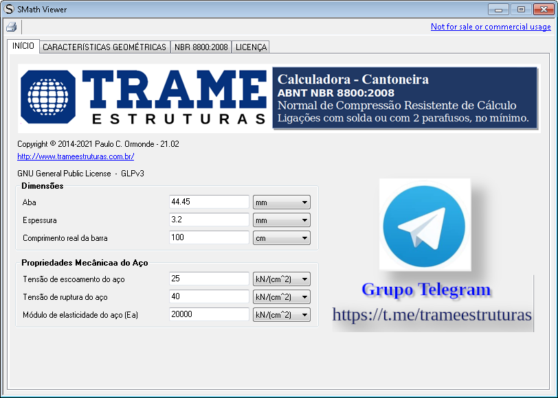

# CALCULADORA CANTONEIRA

Calculadora para cálculo da Normal de Compressão Resistente de Cálculo de **Cantoneiras de Abas Iguais** de acordo com a **ABNT NBR 8800:2008**. O comprimento de flambagem calculado é válido somente para barras com ligações soldadas ou, no mínimo, com 2 parafusos.

## Características do programa

- Programa executável para **Windows** gerado no software [Smath Studio](https://en.smath.com/view/SMathStudio/summary)..
- A calculadora pode ser utilizada em sistemas operacionais **GNU/Linux** via [WINE](https://www.winehq.org).
- Códido-fonte "**paper-like**" para [Smath Studio](https://en.smath.com/view/SMathStudio/summary).

## Uso

Sem necessidade de instalação, basta executar o arquivo **cantoneira.exe** ou abrir no [Smath Studio](https://en.smath.com/view/SMathStudio/summary) o arquivo do código-fonte, **cantoneira.sm**.
No programa executável basta preencher os dados conforme a sequência de abas disponíveis. 

## Licença

[GPLv3](http://www.gnu.org/licenses/)

[Clique aqui para ler a licença](license.txt)

